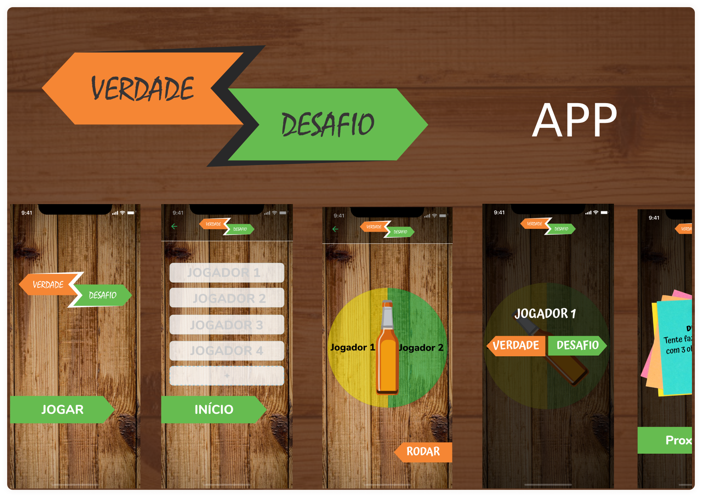

<h1 align="center">
  
</h1>

  

 

  

## ✨ Tecnologias

Esse projeto foi desenvolvido com as seguintes tecnologias:

- [React Native](https://reactnative.dev/)
- [Typescript](https://www.typescriptlang.org/)
- [Expo](https://expo.io/)

## 💻 Projeto

Jogo verdade ou desafio o App desenvolvido para jogar com até 5 pessoas, objstivo é a pergunta, resposta e realização dos desafios em cada rodada.

## 🚀 Como executar

- Baixe e instale seu dispositivo mobile o `Expo Go` obtido direto nas loja digital `PlayStory`.
- Clone o repositório
- Instale os recursos do `Expo-cli`
  > npm install --global expo-cli 
- Instale as dependências com `expo install`
- Inicie seu app com `expo start`

## 📄 Licença

Esse projeto está sob a licença MIT. Veja o arquivo [LICENSE](LICENSE.md) para mais detalhes.

